# File icons
Ready to use icons for different file formats; available in commonly used formats; HD images. Complete icons can be seen in this dribble shot https://dribbble.com/shots/6736416-File-icons 

## Combined Samples

<!---->

## All Icons

| ICONS | ICONS |
|------|------|
| 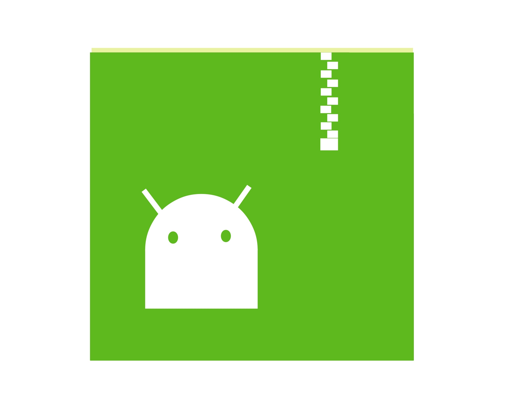 |  |
|  | 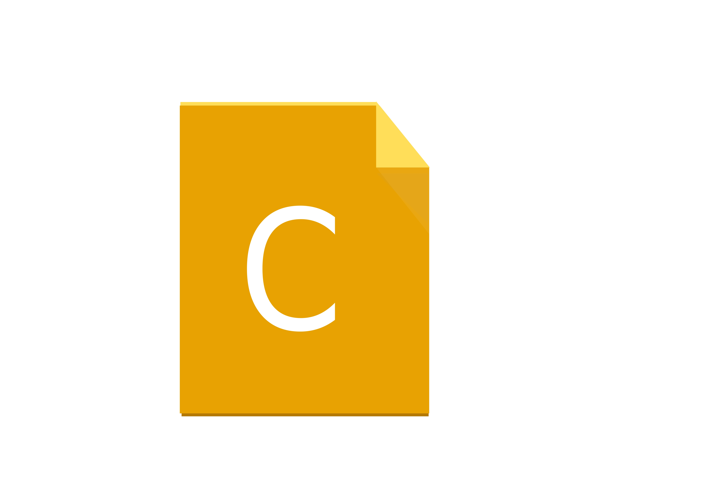 |
| 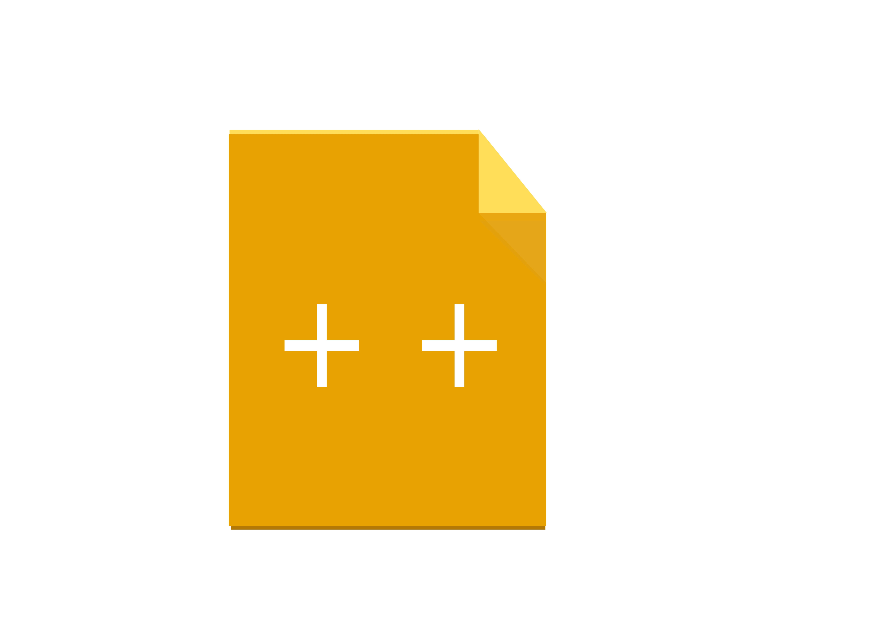 |  |
| 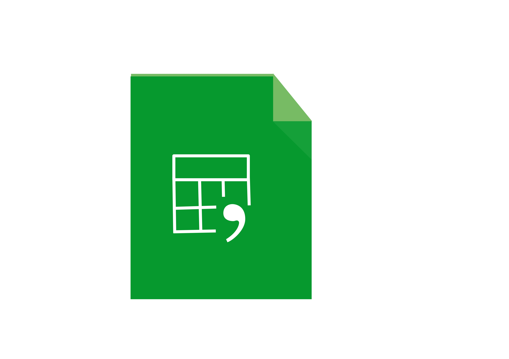 |  |
| 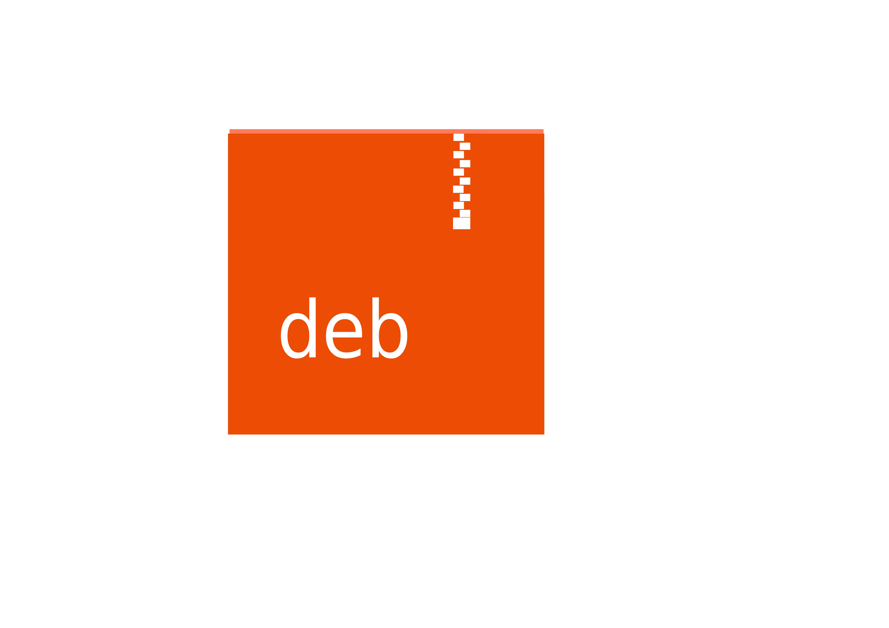 |  |
|  | 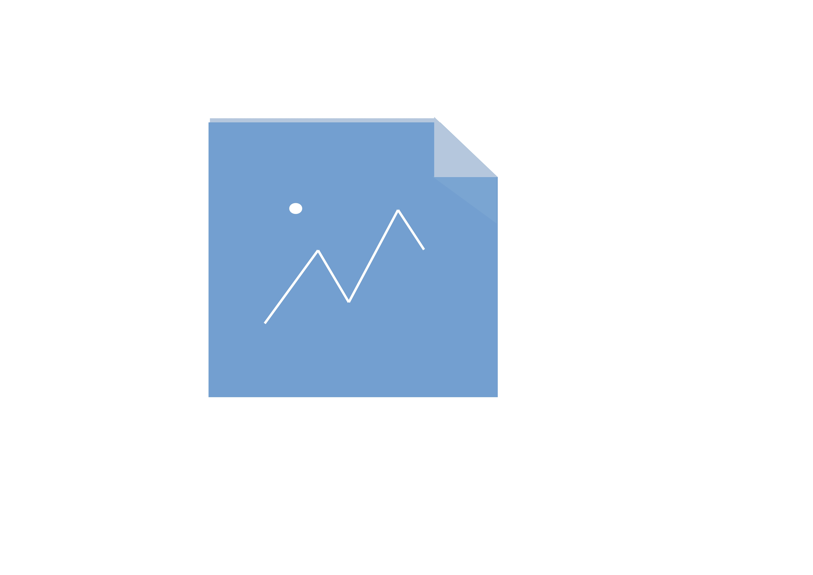 |
|  |  |
|  |  |
|  | 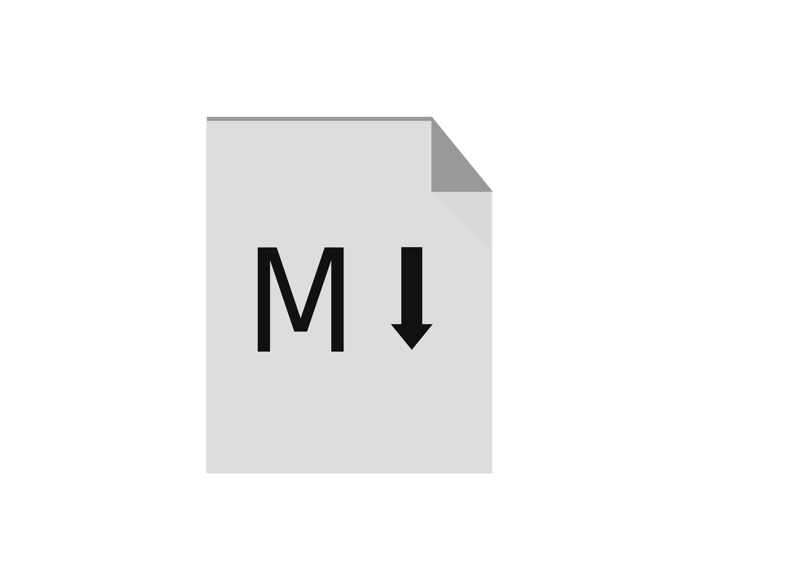 |
| 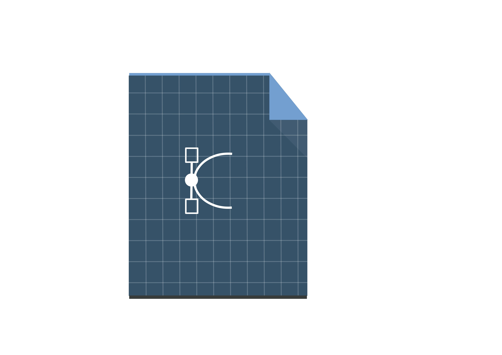 | 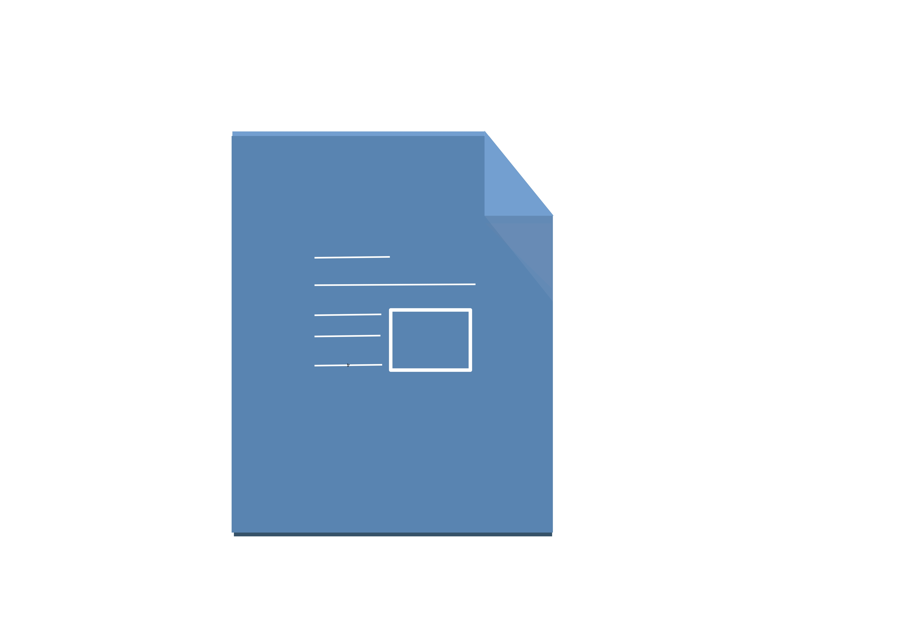 |
|  |  |
|  | 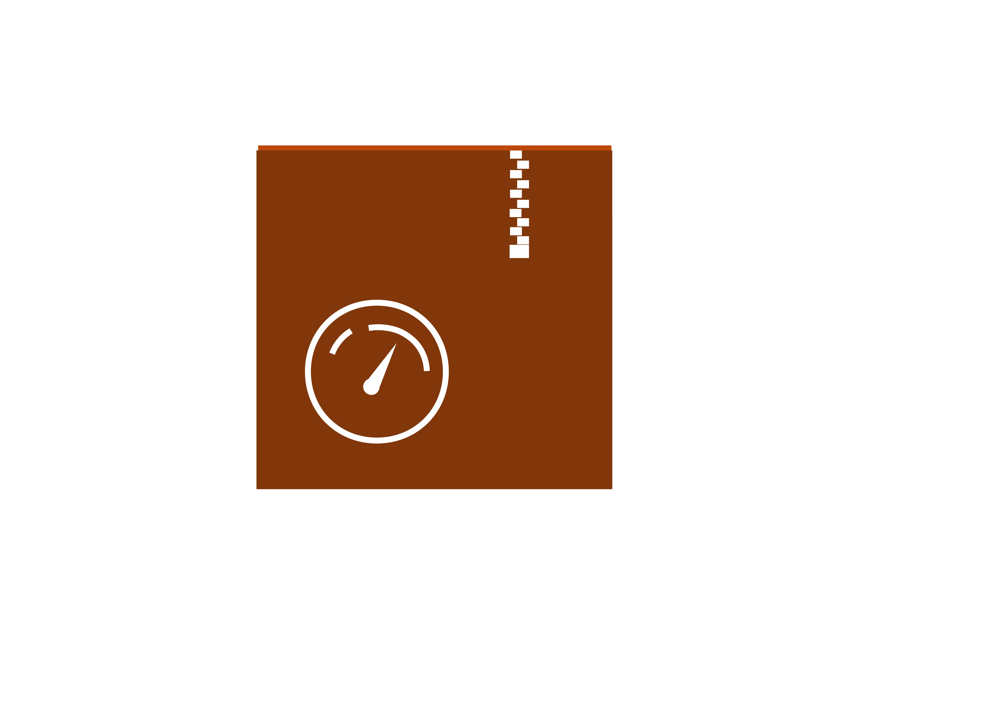 |
| 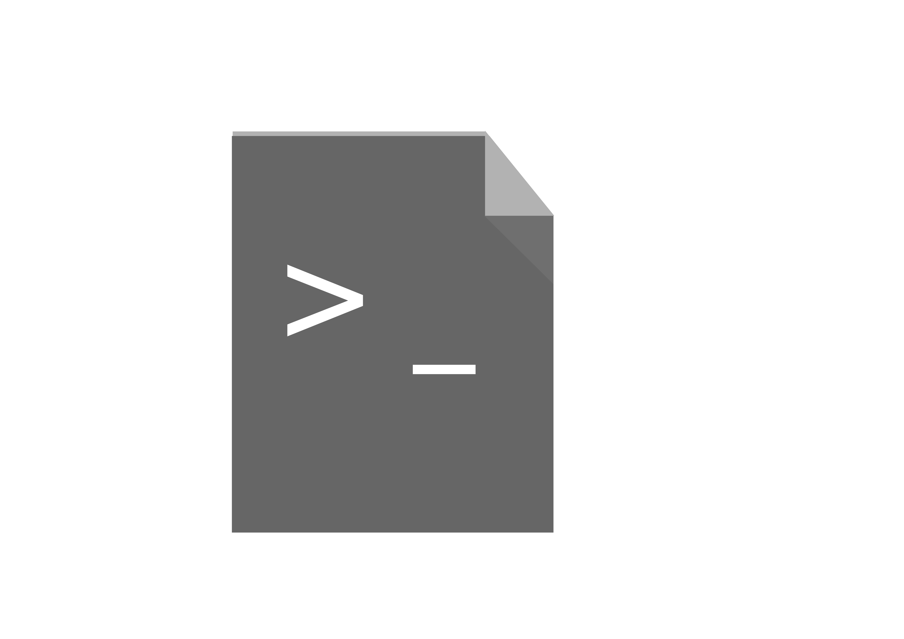 |  |
| 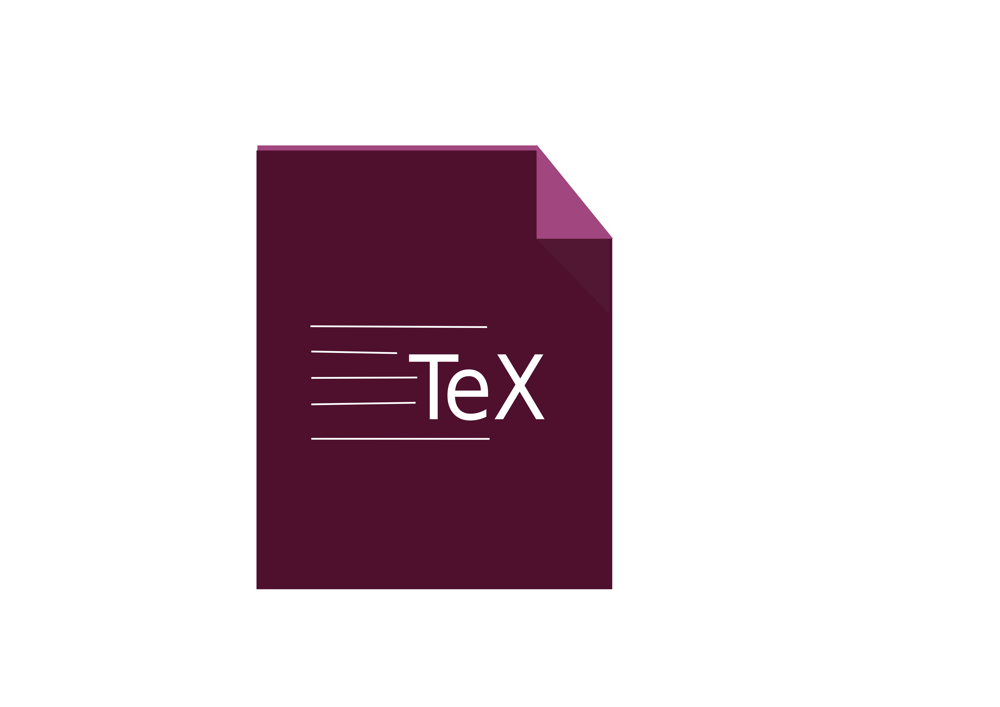 |  |
| 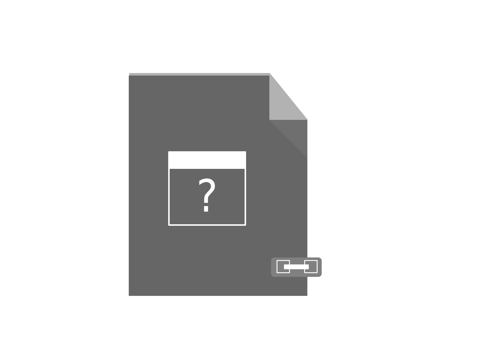 |  |
|  |  |

